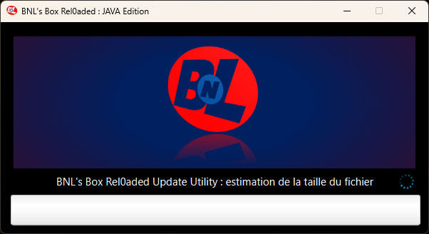

# BNL's Box Rel0aded

Un jeu de Morpion développé en JavaFX dans le cadre d'un travail tuteuré, mettant l'accent sur une interface graphique ergonomique et une expérience utilisateur fluide. Ce projet inclut un système de mise à jour automatique hérité d'un programme précédent, développé sur du temps personnel.

---

## Fonctionnalités

- **Jeu classique de Morpion** : Jouez à un jeu de Morpion contre un autre joueur.
- **Interface utilisateur ergonomique** : Une interface moderne et intuitive pour améliorer l'expérience utilisateur.
- **Menu principal** : Accédez rapidement au jeu, aux paramètres, ou quittez l'application.
- **Menu des paramètres** : Personnalisez votre expérience de jeu et votre interface.
- **Mises à jour automatiques** : Le programme intègre un système de mise à jour efficace.

---

## Captures d'écran

### Menu principal

### Menu des paramètres

### Configuration du jeu

### Écran du jeu

### Classement

### Section d'aide

### Section à propos

### Mise à jour

---

## Prérequis

- **Java** : Assurez-vous d'avoir Java 11 ou une version ultérieure installée.
- **Connexion Internet** : Requise pour vérifier les mises à jour.

---

## Utilisation

1. **Démarrer le jeu** : Accédez au menu principal et choisissez "Jouer".
2. **Configurer l'interface et l'expérience de jeu** : Modifiez les paramètres dans le menu des paramètres.
3. **Mettre à jour** : Le programme vérifie automatiquement les nouvelles versions à chaque démarrage.

---

## Objectifs pédagogiques

Ce projet a été réalisé dans le cadre d'un travail tuteuré visant à :
- Concevoir et développer un jeu en JavaFX.
- Développer une interface graphique ergonomique.
- Appliquer des pratiques de programmation modulaire.

---

## Remerciements

Un grand merci à tous les enseignants et tuteurs pour leur accompagnement, ainsi qu'aux collègues ayant participé à la validation ergonomique.
